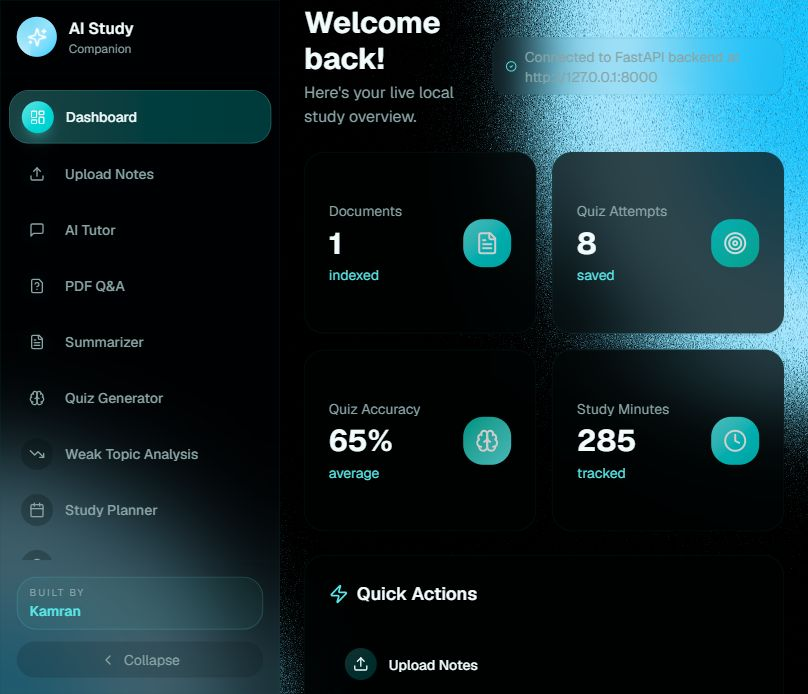
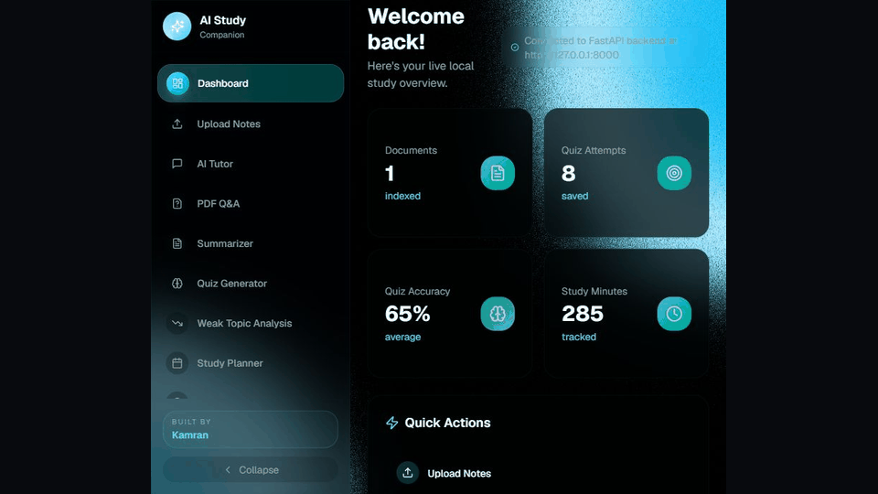

# AI Study Companion

Free, local-first AI-powered Study Companion with a FastAPI backend and a Next.js frontend. It supports PDF ingestion, OCR fallback, RAG question answering, summaries, quiz generation, weak-topic detection, recommendations, analytics, flashcards, topic clustering, and seeded demo data.

## Features

- FastAPI backend for the Next.js frontend
- PDF text extraction with PyPDF2 and PyMuPDF
- OCR fallback for scanned PDFs through local Tesseract
- SQLite persistence for documents, chunks, quizzes, answers, study sessions, and flashcards
- Local RAG retrieval using TF-IDF by default, with optional sentence-transformers
- Local demo dataset: `ML Unit 1-5 Demo Notes`
- 120-question demo quiz bank
- Weak-topic analytics and recommendation logic
- Topic clustering with scikit-learn
- Streamlit legacy app still available in `backend/app.py`

## Why This Project Is Useful

AI Study Companion turns static study material into an active learning system. Instead of only reading PDFs, students can ask questions, get summaries, practice quizzes, discover weak topics, follow a study plan, and track progress from one dashboard.

This is useful for:

- Students preparing for exams from long PDFs, lecture notes, and unit-wise material
- Portfolio projects that demonstrate real AI engineering, not only UI design
- Learning RAG, embeddings, OCR, SQLite, analytics, recommendation systems, and ML workflows
- Building a local-first AI app without paid APIs or cloud costs
- Creating a foundation for future SaaS features such as user accounts, hosted storage, and advanced model serving

## App Sections

- Dashboard: Shows a quick overview of indexed documents, quiz attempts, accuracy, study minutes, weak topics, and revision priorities.
- Upload Notes: Lets users upload PDF study material. The backend extracts text, uses OCR for scanned PDFs when available, chunks the content, and prepares it for search and AI features.
- AI Tutor: Works like a study mentor. Users can ask broad questions across the available study material and get grounded answers from the local knowledge base.
- PDF Q&A: Lets users select a specific PDF and ask document-based questions with source snippets and page references.
- Smart Summarizer: Generates whole-document summaries or chunk-wise topic summaries for faster revision.
- Quiz Generator: Creates MCQs and short-answer questions from study material, grades responses, and stores performance history.
- Weak Topic Analysis: Finds topics where quiz accuracy is low and highlights what needs revision.
- Study Planner: Builds a weekly study plan based on weak areas and recommended revision tasks.
- Recommendations: Suggests what to study next using quiz results, weak topics, and study activity.
- Topic Clustering: Groups related chunks and concepts using ML clustering so users can understand how topics are connected.
- Analytics Dashboard: Visualizes accuracy, attempts, progress, and learning performance over time.
- Flashcards: Provides spaced-repetition style review cards generated from the indexed material.
- Progress Tracker: Tracks study consistency, completed activities, and improvement signals.
- Settings: Keeps app-level controls and configuration space for future features.

## Screenshots and Demo





More screenshots:

- [Upload Notes](docs/media/upload-notes.png)
- [AI Tutor](docs/media/ai-tutor.png)
- [PDF Q&A](docs/media/pdf-qa.png)
- [Quiz Generator](docs/media/quiz-generator.png)
- [Analytics Dashboard](docs/media/analytics-dashboard.png)
- [Topic Clustering](docs/media/topic-clustering.png)

## Run Locally

Backend:

```powershell
cd C:\Users\ibrah\Downloads\b_HUDWK5qTByF\ai_study_companion\backend
python -m uvicorn api_server:app --host 127.0.0.1 --port 8000
```

Frontend:

```powershell
cd C:\Users\ibrah\Downloads\b_HUDWK5qTByF\ai_study_companion\frontend
npm install
npm run dev
```

App URL:

```text
http://127.0.0.1:3000
```

Backend URL:

```text
http://127.0.0.1:8000
```

Health check:

```text
http://127.0.0.1:8000/health
```

## Install

```powershell
cd backend
python -m venv .venv
.venv\Scripts\activate
pip install -r requirements.txt
```

For scanned PDFs, install Tesseract OCR locally. On Windows, the app automatically checks:

```text
C:\Program Files\Tesseract-OCR\tesseract.exe
```

## API Endpoints

- `GET /health`
- `GET /documents`
- `POST /documents/upload`
- `GET /dashboard`
- `POST /ask`
- `POST /summarize`
- `POST /quiz/generate`
- `POST /quiz/submit`
- `POST /topics/cluster`
- `GET /recommendations`
- `POST /study-sessions`

## Project Structure

```text
ai_study_companion/
  backend/                       FastAPI backend
    api_server.py                FastAPI app and REST endpoints
    app.py                       Legacy Streamlit app
    requirements.txt             Python dependencies
    docs/
      ARCHITECTURE.md            Architecture and ML workflow
      DEPLOYMENT.md              Free deployment notes
    study_companion/
      analytics.py               Dashboard metrics and charts
      config.py                  Paths, model names, runtime settings
      database.py                SQLite schema and data access
      demo_data.py               ML Unit 1-5 demo seed data
      embeddings.py              Retrieval vectors and search
      flashcards.py              Flashcard generation helpers
      ml_models.py               Weak-topic classifier and clustering
      pdf_processing.py          PDF extraction and OCR fallback
      quiz.py                    MCQ and short-answer generation
      rag.py                     Retrieval-augmented answering
      recommender.py             Recommendations and weekly plans
      summarizer.py              Local summarization fallback
      text_processing.py         Cleaning, chunking, keywords
      ui.py                      Legacy Streamlit UI helpers
  frontend/                      Next.js frontend
    app/                         App router pages and global CSS
    components/                  Dashboard, sections, and UI components
    lib/                         Frontend API client and utilities
    public/                      Static assets
    package.json                 Frontend dependencies and scripts
```

## Notes

This project uses only free and open-source tools. No OpenAI API or paid cloud API is required. Local runtime data such as SQLite databases, uploaded PDFs, model caches, and Python bytecode are ignored by Git.
